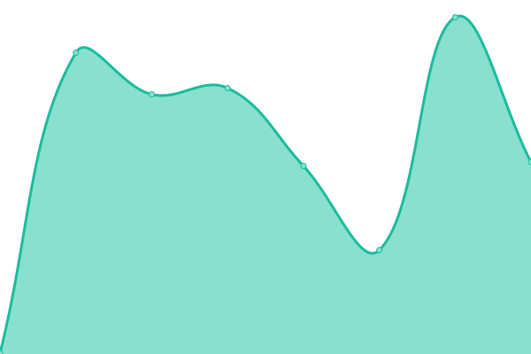
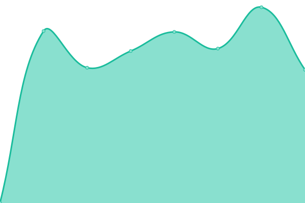
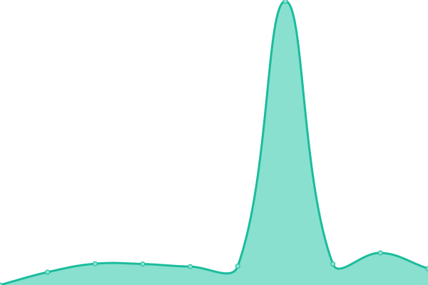
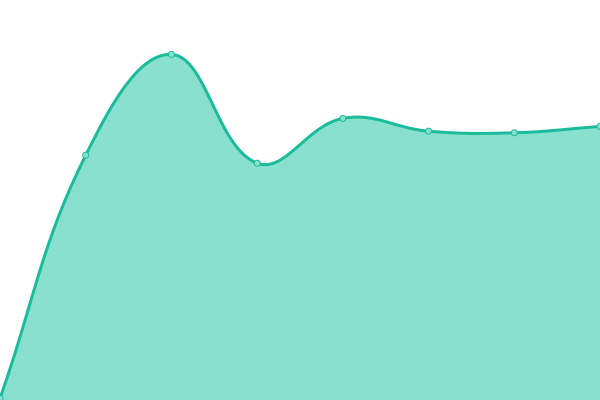
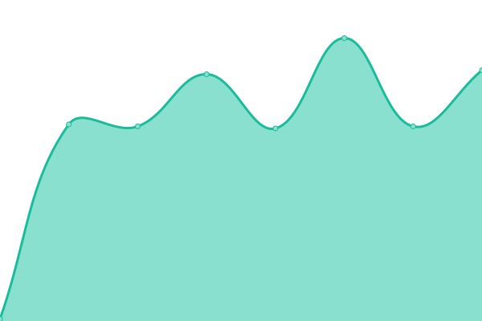

# [📈 Live Status](https://status.zov.tatar): <!--live status--> **🟩 All systems operational**

This repository contains the open-source uptime monitor and status page for [Upptime](https://upptime.js.org), powered by [Upptime](https://github.com/upptime/upptime).

With [Upptime](https://upptime.js.org), you can get your own unlimited and free uptime monitor and status page, powered entirely by a GitHub repository. We use [Issues](https://github.com/upptime/upptime/issues) as incident reports, [Actions](https://github.com/F1F1FISHKA/uptime/actions) as uptime monitors, and [Pages](https://status.zov.tatar) for the status page.

<!--start: status pages-->
<!-- This summary is generated by Upptime (https://github.com/upptime/upptime) -->
<!-- Do not edit this manually, your changes will be overwritten -->
<!-- prettier-ignore -->
| URL | Status | History | Response Time | Uptime |
| --- | ------ | ------- | ------------- | ------ |
|  [ZTorch LABS — Main Site](https://zov.tatar) | 🟩 Up | [z-torch-labs-main-site.yml](https://github.com/F1F1FISHKA/uptime/commits/HEAD/history/z-torch-labs-main-site.yml) | 

 292ms
     
 | 

<a href="https://status.zov.tatar/history/z-torch-labs-main-site">100.00%</a>
    

|  [ZTorch LABS — Games dashboard](https://dash.zov.tatar) | 🟩 Up | [z-torch-labs-games-dashboard.yml](https://github.com/F1F1FISHKA/uptime/commits/HEAD/history/z-torch-labs-games-dashboard.yml) | 

 1475ms
     
 | 

<a href="https://status.zov.tatar/history/z-torch-labs-games-dashboard">99.70%</a>
    

|  [ZTorch LABS — Cloud](https://data.zov.tatar) | 🟩 Up | [z-torch-labs-cloud.yml](https://github.com/F1F1FISHKA/uptime/commits/HEAD/history/z-torch-labs-cloud.yml) | 

 3487ms
     
 | 

<a href="https://status.zov.tatar/history/z-torch-labs-cloud">99.71%</a>
    

|  [Mail — SMTP](mail.zov.tatar) | 🟩 Up | [mail-smtp.yml](https://github.com/F1F1FISHKA/uptime/commits/HEAD/history/mail-smtp.yml) | 

 174ms
     
 | 

<a href="https://status.zov.tatar/history/mail-smtp">99.72%</a>
    

|  [Mail — IMAP SSL](mail.zov.tatar) | 🟩 Up | [mail-imap-ssl.yml](https://github.com/F1F1FISHKA/uptime/commits/HEAD/history/mail-imap-ssl.yml) | 

 173ms
     
 | 

<a href="https://status.zov.tatar/history/mail-imap-ssl">100.00%</a>
    

|  [Main Node — IP](88.87.85.236) | 🟩 Up | [main-node-ip.yml](https://github.com/F1F1FISHKA/uptime/commits/HEAD/history/main-node-ip.yml) | 

 173ms
     
 | 

<a href="https://status.zov.tatar/history/main-node-ip">100.00%</a>
    

|  [Node-02 — IP](95.181.162.169) | 🟩 Up | [node-02-ip.yml](https://github.com/F1F1FISHKA/uptime/commits/HEAD/history/node-02-ip.yml) | 

 120ms
     
 | 

<a href="https://status.zov.tatar/history/node-02-ip">100.00%</a>
    

|  [Node n-01](ping.n-01.zov.tatar) | 🟩 Up | [node-n-01.yml](https://github.com/F1F1FISHKA/uptime/commits/HEAD/history/node-n-01.yml) | 

 172ms
     
 | 

<a href="https://status.zov.tatar/history/node-n-01">100.00%</a>
    

|  [Node n-02](ping.n-02.zov.tatar) | 🟩 Up | [node-n-02.yml](https://github.com/F1F1FISHKA/uptime/commits/HEAD/history/node-n-02.yml) | 

 119ms
     
 | 

<a href="https://status.zov.tatar/history/node-n-02">100.00%</a>
    

<!--end: status pages-->

[**Visit our status website →**](https://status.zov.tatar)

## 📄 License

- Powered by: [Upptime](https://github.com/upptime/upptime)
- Code: [MIT](./LICENSE) © [Anand Chowdhary](https://anandchowdhary.com), supported by [Pabio](https://pabio.com)
- Data in the `./history` directory: [Open Database License](https://opendatacommons.org/licenses/odbl/1-0/)
